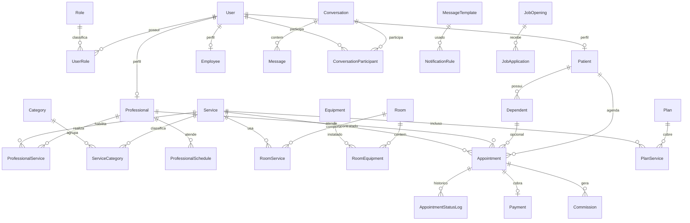

# Backend AIO

API em Node.js + Express + TypeScript, usando Prisma sobre o Postgres gerenciado pelo Supabase.

## Estrutura

- `src/index.ts` / `src/app.ts`: bootstrap do servidor Express.
- `src/routes/*.ts`: rotas HTTP, uma por domínio (auth, catálogo, agenda, agendamentos, bloqueios, pacientes, prontuários, métricas, admin, serviços, clínica/integrações, recrutamento, uploads).
- `src/dto/*.ts`: mapeamento entre o schema Prisma e os contratos JSON usados pelo front-end.
- `src/lib/*.ts`: utilidades (JWT, hash de senha, datas, detecção de conflito de horário, período de métricas).
- `src/middleware/*.ts`: autenticação JWT (`requireAuth`, `requireRole`) e tratamento central de erros.
- `src/jobs/*.ts`: stubs de heartbeat (paridade com os hosted services da versão anterior — sem lógica real de disparo).
- `prisma/schema.prisma`: schema completo do Postgres.
- `prisma/seed.ts`: dados de demonstração (usuários de teste, catálogo, agenda, configurações white-label etc).

## Configuração

Copie `.env.example` para `.env` e preencha com as credenciais do seu projeto Supabase:

```bash
cp .env.example .env
```

- `DATABASE_URL`: connection string do pooler em modo *transaction* (porta 6543) — usada em runtime pelo Prisma Client.
- `DIRECT_URL`: connection string do pooler em modo *session* (porta 5432) — usada por `prisma db push`/`migrate`.
- `SUPABASE_URL` / `SUPABASE_SECRET_KEY` / `SUPABASE_STORAGE_BUCKET`: acesso ao Supabase Storage (upload de anexos).
- `JWT_*`: emissão/validação dos tokens da própria API (auth independente do Supabase Auth).
- `CORS_ORIGINS`: origens extras liberadas (além de `localhost`/`127.0.0.1`), por exemplo o domínio da Vercel.

## Rodar

```bash
npm install
npm run prisma:push   # cria/atualiza o schema no Postgres do Supabase
npm run seed           # popula dados de demonstração (idempotente — não duplica se já rodou)
npm run dev             # inicia a API em http://127.0.0.1:5088 (porta configurável via PORT)
```

Outros scripts úteis: `npm run build` / `npm start` (build de produção), `npm run prisma:studio` (explorar o banco).

## Autenticação

JWT próprio (não usa o Supabase Auth): login/cadastro emitem um par `token` (access, expira em `JWT_ACCESS_TOKEN_MINUTES`) + `refreshToken` (rotativo, expira em `JWT_REFRESH_TOKEN_DAYS`, hash SHA-256 armazenado no banco). Senhas com hash bcrypt real.

Roles: `paciente`, `profissional`, `recepcao`, `admin` — cada uma com uma role só por usuário na prática, embora o schema suporte N:N.

## Seeds

Os seeds espelham a demonstração original:

- 4 usuários de teste: `paciente@aio.com`, `profissional@aio.com`, `recepcao@aio.com`, `admin@aio.com` (todos com senha `senha123`, agora com hash bcrypt real).
- 8 serviços em 4 categorias, 4 salas, 4 equipamentos.
- 7 profissionais (5 atendentes com regras de comissão específicas + 2 administrativos).
- 1 paciente com 2 dependentes, agendamentos de exemplo com pagamento/comissão.
- Configurações white-label completas (tema, endereço, redes sociais, banners, sobre, marcos históricos).
- Métricas e custos de exemplo para os últimos 6 meses.

## Diagrama ER


