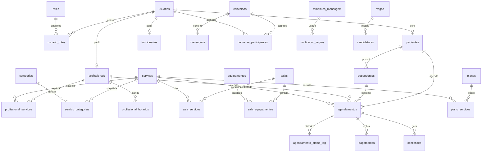

# Backend AIO

Fases 2 e 3 implementadas com .NET 10, ASP.NET Core Web API, Entity Framework Core 10, SQL Server em Docker, JWT com refresh token e endpoints reais para integracao do front.

## Estrutura

- `Aio.Api`: controllers e configuracao HTTP.
- `Aio.Application`: interfaces e services.
- `Aio.Domain`: entidades de dominio.
- `Aio.Infrastructure`: EF Core, `DbContext`, repositories, migrations e seeds.
- `Scripts/001_initial_create.sql`: script SQL idempotente gerado a partir da migration inicial.
- `Scripts/002_phase3_auth_and_integration.sql`: script SQL idempotente com `refresh_tokens`.

## Rodar SQL Server

Na raiz do monorepo:

```bash
docker compose up -d sqlserver
```

Connection string padrao:

```text
Server=localhost,14330;Database=Aio;User Id=sa;Password=TroqueEstaSenha!2026;TrustServerCertificate=True;Encrypt=False;Connect Timeout=60
```

A porta local `14330` evita conflito com instancias locais que ja usam `1433`.

## Aplicar migrations

```bash
cd backend
dotnet tool restore
dotnet ef database update --project Aio.Infrastructure/Aio.Infrastructure.csproj --startup-project Aio.Api/Aio.Api.csproj
```

## Rodar API

```bash
cd backend
dotnet run --project Aio.Api/Aio.Api.csproj --urls http://127.0.0.1:5088
```

Endpoints minimos de validacao:

- `GET /api/configuracoes`
- `PUT /api/configuracoes` com role `admin`
- `POST /api/auth/login`
- `POST /api/auth/cadastro`
- `POST /api/auth/refresh`
- `GET /api/catalogo/servicos`
- `GET /api/catalogo/profissionais`
- `GET /api/catalogo/categorias`
- `GET /api/agenda`
- `POST /api/agenda/agendamentos` autenticado
- `GET /api/metricas`
- `GET /api/metricas/custos`
- `GET /api/recrutamento/vagas`
- `GET /api/recrutamento/candidaturas`
- `GET /api/integracoes` com role `admin`
- `GET /api/jobs` com role `admin`

## Seeds

Os seeds espelham os mocks da fase 1:

- usuarios de teste: `paciente@aio.com`, `profissional@aio.com`, `recepcao@aio.com`, `admin@aio.com`
- 8 servicos em categorias
- 5 profissionais atendentes e 2 funcionarios nao atendentes
- dependentes, agendamentos, conversas, templates, regras de notificacao
- banners, configuracoes white label, conteudo Sobre, metricas e custos
- vagas, candidaturas e banco de talentos

As senhas estao armazenadas como marcador de seed (`seed:senha123`) e devem ser substituidas por hash real na fase 3.

## Diagrama ER


